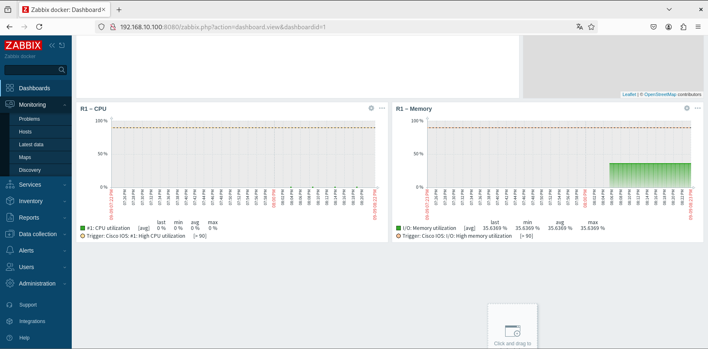

# Zabbix 7 + Docker + GNS3 (SNMP)

A small lab that monitors Cisco devices (IOSv / IOSvL2 in GNS3) using **Zabbix 7 LTS on Docker**.  
It includes server, web UI, PostgreSQL and Agent2. We add SNMP hosts (R1 and SW-L3) and a dashboard with **CPU / Memory / Traffic**.


---

## 📌 What you get

- **R1** and **SW-L3** monitored over **SNMP**  
  
- A dashboard with **CPU and Memory** for R1 (easy to clone for SW-L3)  
  

---

## ✅ Requirements

- Debian 12 / Ubuntu 22.04 (or similar)
- Docker + Docker Compose
- GNS3 with IOSv/IOSvL2 (or any gear that speaks SNMP)

---

## 🔧 Environment variables

Create a **`.env`** (start from this example):

```env
# .env.example
TZ=America/Santiago

POSTGRES_USER=zabbix
POSTGRES_PASSWORD=zabbix
POSTGRES_DB=zabbix

🚀 Deploy
docker compose up -d

# Web UI:
# http://<your-server-ip>:8080   (use HTTP, not HTTPS)
# Default login:  Admin / zabbix

🌐 Connectivity to the GNS3 lab

My VM had two NICs (NAT + host-only). To reach the /30 toward R1 I added a static route:

# Example: switch LAN is 192.168.10.0/24 and the VM's next-hop is 192.168.10.1
sudo ip route add 10.10.10.0/30 via 192.168.10.1 dev <your_hostonly_iface>
# In my case: dev ens37

Adjust IPs and interface names as needed.

🛰️ SNMP on Cisco (GNS3)

On R1 and SW-L3:

conf t
 snmp-server community ZBXRO RO
 snmp-server ifindex persist
 ! optional
 snmp-server contact lab
 snmp-server location gns3
end
wr


In Zabbix I used SNMP v2 and community ZBXRO.

➕ Add hosts in Zabbix

Data collection → Hosts → Create host

R1

Host name: R1

Interfaces → SNMP: 10.10.10.1 port 161

Templates: Cisco IOS by SNMP

Enable

SW-L3

Host name: SW-L3

Interfaces → SNMP: 192.168.10.1 port 161

Templates: Cisco IOS by SNMP

Enable

Items and discoveries (interfaces, etc.) will appear within 1–2 minutes.

📊 Dashboard (quick demo)

Dashboards → Create dashboard → LAB – Overview

Add widget → Graph (classic)

R1 – CPU → Host: R1 → Item: CPU utilization → Refresh: 30s → Add

Duplicate for R1 – Memory → Item: Processor: Memory utilization

Add widget → Graph (classic → Simple graph)

R1 – Gi0/0 Traffic → Items: Gi0/0: Bits received/s + Gi0/0: Bits sent/s

Repeat 2–4 for SW-L3 if you want both devices.

Tip: set Time period → Last 15 minutes and Refresh → 10 seconds to make the charts feel “alive”.

🧪 Useful commands

docker compose ps
docker logs -f zbx-server
docker logs -f zbx-web


🧯 Troubleshooting

AppArmor / Agent2
Error like failed to apply apparmor profile → handled via:

security_opt:
  - apparmor:unconfined


HTTPS on port 8080
If you hit SSL_ERROR_RX_RECORD_TOO_LONG you’re using HTTPS. Use HTTP on http://<ip>:8080.

Can’t ping R1 from the server
Add the correct static route (example above) and verify your host-only network/firewall.

📁 Repository layout

.
├── docker-compose.yml
├── .env.example
├── docs/
│   ├── Agentes SNMP activos.png
│   ├── CPU, RAM R1.png
│   └── Topologia.png
└── README.md

